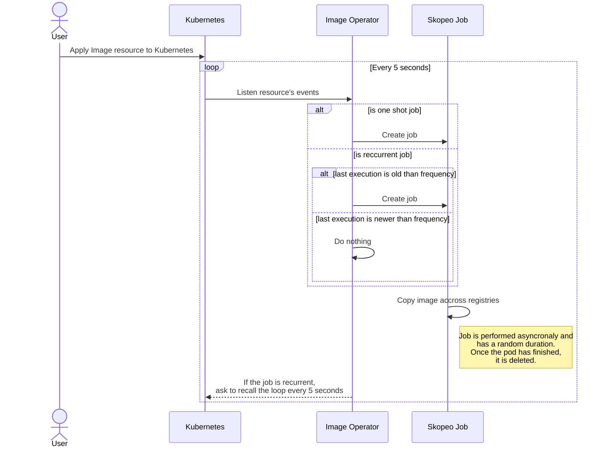

# image-operator

Image Operator simplifies the process of synchronizing container images across registries and supports both one-time and scheduled tasks. Built around Skopeo, it offers Kubernetes-native orchestration for copying, managing, and monitoring images in your ecosystem.

## Install with Helm Chart

```bash
helm repo add image-operator https://tchoupinax.github.io/image-operator
helm repo update

helm upgrade --install image-operator image-operator/image-operator
```

## Usage

According the use-case you have, select the good configuration for you:

### Image Synchronization (`Image`)

The `Image` resource allows you to copy container images across registries, supporting both public and private registries. Supported public registries include:

- `AWS public ECR`: https://gallery.ecr.aws
- `DockerHub`: https://hub.docker.com
- `Quay.io`: https://quay.io/search

#### Use Cases

1. One-time sync of a specific tag

For a one-time sync of a specific version, use `OneShot` mode and specify the desired tag (e.g., v1.2.3).

2. Automatic sync of new versions matching a pattern

To auto-sync a specific version pattern (e.g., `v1.2.x`), use `OnceByTag` mode. This will sync the current and future matching versions (e.g., `>v1.2.0` & `<v1.3.0`).

3. Regular image refresh

For periodic syncing (e.g., daily), use Recurrent mode and specify the version tag (e.g., node:22-alpine).

#### Example of recurrent task

> Copy `quay.io/nginx/nginx-ingress:3.7-alpine` to `tchoupinax/nginx/nginx-ingress:3.7-alpine` every 15 minutes.

```yaml
apiVersion: skopeo.io/v1alpha1
kind: Image
metadata:
  name: nginx-alpine
spec:
  frequency: 15m
  mode: Recurrent
  source:
    name: quay.io/nginx/nginx-ingress
    version: 3.7-alpine
  destination:
    name: tchoupinax/nginx/nginx-ingress
    version: 3.7-alpine
```

#### Sync by tag pattern

⚠️ WARNING: please check what you are doing. According the pattern and the repository, it can create thousands of jobs!

You can order to copy every images matching a pattern. For exemple, if you want to copy every image like `2.13.1`, `2.13.2`, `2.13.3` etc... you can put version as `2.13.x`.
Moreover, if you want to include release candidate you can with the option `allowCandidateRelease: true`. It will create a Kubernetes job for each version detected.

It's support pattern like:
- `2.x.0`
- `3.1.x`
- `4.x.x`

Please use this pattern with cautious!

> I want to copy every image `>=2.13` and `<2.14` and I accept release candidates (tag having `-rc{\d}{1,2}`)

```yaml
apiVersion: skopeo.io/v1alpha1
kind: Image
metadata:
  name: argocd-2-13-rc
spec:
  allowCandidateRelease: true
  mode: OneShot
  source:
    name: quay.io/argoproj/argocd
    version: v2.13.x
  destination:
    name: tchoupinax/argoproj/argocd
    version: v2.13.x
```

#### Example with full options explained

```yaml
apiVersion: skopeo.io/v1alpha1
kind: Image
metadata:
  name: name
spec:
  allowCandidateRelease: false # Activate if you want release which match *.*.*-rc[O-9]+
  mode: OneShot # Accepted: OneShot,OnceByTag,Recurrent
  frequency: "1m" #  Accepted: [O-9]+(s(second),m(minute),h(hour),d(day),(week)
  source:
    name: source/argoproj/argocd
    version: v2.13.x
  destination:
    name: destination/argoproj/argocd
    version: v2.13.x
```

#### Copy on the fly (`Experimental`)

⚠️ This feature is usable **at your own risk**. It's still experimental.

The operator listens for pod events and detects when a pod is created, but the image is not found in the registry. In such cases, it assumes the image is not present in the target registry and that it needs to be copied from Dockerhub (or another registry). Based on this detection, the operator attempts to determine the correct image to copy and creates a job to perform the transfer.

To activate this feature:
- Provide `FEATURE_COPY_ON_THE_FLY` as `true`
- With helm chart, set `.Values.config.features.copyOnTheFly.enabled` to `true`

🚨 Namespace scope 🚨

On large cluster, there are many pods to listen. In this case, operator might require lot of memory to run (between 1G and 2G for average of 1500 pods). If you do not care about it, it's OK.

But if it is an issue for you, you can limit which namespaces are listened by the operator for this feature. It can be done with:

- Provider `FEATURE_COPY_ON_THE_FLY_NAMESPACES_ALLOWED` as an array of namespaces.
- With helm chart, add namespaces to the array at `.Values.config.features.copyOnTheFly.namespacesAllowed`. By default it's `- *`.

### Build image (`ImageBuilder`)

The `ImageBuilder` resource allows you to build images from a Dockerfile source. It uses Buildah under the hood to offer cross architectures builds.

#### Example with full options explained

```yaml
apiVersion: buildah.io/v1alpha1
kind: ImageBuilder
metadata:
  name: name
spec:
  architecture: "arm64" # Accepted: arm64;amd64;both
  image:
    name: destination/node
    version: 22-updated
    useAwsIRSA: false # Accepted: false,true
  source: | # This field is a Dockerfile
    FROM node:22
    RUN apt update -y && apt upgrade -y
  resources:
    limits:
      cpu: 1000m # Decouraged to setup a cpu limit
      memory: 2Gi
    requests:
      cpu: 500m
      memory: 1Gi
```

## Motivation

We aim to use container images exclusively from our internal registry for various reasons. Among these images, a significant portion consists of "base" images that we did not build ourselves. However, the process of copying these base images presents several challenges:

- It may require authentication, adding complexity to the process.
- Copying images for multiple architectures simultaneously can be cumbersome.
- Not everyone in the organization may have the necessary permissions to perform this operation.
- The stability of the process can vary depending on the method used (e.g., CI/CD pipelines).

Among the various open-source projects known for their ability to build and copy images, one stands out for its efficiency in copying images across registries: [Skopeo](https://github.com/containers/skopeo).

How can we industrialize this process? While it’s possible to use CI for this purpose, incorporating a one-off task into the CI pipeline doesn’t seem advantageous. For example, if we only need to copy the nginx:1.1.1-alpine image once, embedding this operation into the CI process isn't relevant or efficient. We need a more suitable approach for handling such single-use cases. The same limitations apply to recurring tasks. While CI systems can be configured to handle such tasks with scheduled jobs or cron-like setups, they are quite limited.

The idea of building an operator around Skopeo originates from the desire to leverage the right tool in conjunction with the operator pattern, to benefit from Kubernetes's simplicity and scalability.

## Description



## Configuration

## Helm chart

You can find an exemple of values [here](charts/image-operator/values.yaml).

### Environment variables list

Below are all environment handled by the app with their default values.

- `API_AWS_PAGE_ITEMS_COUNT`: "1000"
- `API_AWS_PAGE_MAX`: "4"
- `BUILDAH_IMAGE`: "quay.io/containers/buildah"
- `BUILDAH_JOB_NAMESPACE`: "image-operator-system"
- `BUILDAH_PRIVILEGED_CONTAINER`: "false"
- `BUILDAH_VERSION`: "v1.37.3"
- `CREDS_DESTINATION_PASSWORD`: ""
- `CREDS_DESTINATION_USERNAME`: ""
- `CREDS_SOURCE_PASSWORD`: ""
- `CREDS_SOURCE_USERNAME`: ""
- `DESTINATION_DEFAULT_AWS_IRSA_USAGE`: "false"
- `DESTINATION_DEFAULT_REGISTRY`: ""
- `DISABLE_DEST_TLS_VERIFICATION`: "false"
- `DISABLE_SRC_TLS_VERIFICATION`: "false"
- `FEATURE_COPY_ON_THE_FLY_ENABLED`: "false"
- `FEATURE_COPY_ON_THE_FLY_NAMESPACES_ALLOWED`: "*"
- `FEATURE_DOCKERHUB_RATE_LIMIT_ENABLED`: "false"
- `FEATURE_DOCKERHUB_RATE_LIMIT_FREQUENCY_SECOND`: "60"
- `PULL_JOB_NAMESPACE`: "image-operator-system"
- `SKOPEO_IMAGE`: "quay.io/containers/skopeo"
- `SKOPEO_VERSION`: "v1.16.1"
- `JOB_DELETION_DELAY_SECONDS`: "10"

## Features

- [x] Copy images accross registries
- [x] Copy images recurrently, frequency is configurable
- [x] Authentication on Password and Username
- [x] Basic monitoring and metrics
- [x] Allow to copy release candidates
- [x] Allow to target version following a pattern
  - [x] Quay.io
  - [x] Dockerhub
  - [x] AWS public ECR
- [x] Build cross architectures images

## Monitoring

Operator exposes a Prometheus route to show basic metrics about operator and how many reload it has been done.


## Development

### Prerequisites
- go version v1.23.0+
- docker version 17.03+.
- kubectl version v1.11.3+.
- Access to a Kubernetes v1.11.3+ cluster.

### Run

```
npx nodemon --watch './**/*.go' --signal SIGTERM --exec go run cmd/main.go
```

### Tests

Command to launch a specific test

```bash
go run github.com/onsi/ginkgo/v2/ginkgo -r --randomize-all --randomize-suites --race --trace -cover internal/helpers/
```

Focus a test

```
go run github.com/onsi/ginkgo/v2/ginkgo run --focus "Node.js" internal/helpers/
```

## Rate limiting

### Dockerhub

[source](https://www.docker.com/blog/checking-your-current-docker-pull-rate-limits-and-status)

## Memory usage Documentation

- https://gist.github.com/j33ty/79e8b736141be19687f565ea4c6f4226
- https://github.com/external-secrets/external-secrets/issues/721
- https://github.com/kubernetes-sigs/controller-runtime/blob/main/designs/cache_options.md
- https://github.com/kubernetes-sigs/controller-runtime/issues?q=cache
- https://github.com/operator-framework/operator-sdk/issues/6255
- https://medium.com/@timebertt/kubernetes-controllers-at-scale-clients-caches-conflicts-patches-explained-aa0f7a8b4332
- https://tyk.io/blog/the-role-of-controller-runtime-manager-in-kubernetes-operators/

### To Deploy on the cluster
**Build and push your image to the location specified by `IMG`:**

```sh
make docker-build docker-push IMG=<some-registry>/image-operator:tag
```

**NOTE:** This image ought to be published in the personal registry you specified.
And it is required to have access to pull the image from the working environment.
Make sure you have the proper permission to the registry if the above commands don’t work.

**Install the CRDs into the cluster:**

```sh
make install
```

**Deploy the Manager to the cluster with the image specified by `IMG`:**

```sh
make deploy IMG=<some-registry>/image-operator:tag
```

> **NOTE**: If you encounter RBAC errors, you may need to grant yourself cluster-admin
privileges or be logged in as admin.

**Create instances of your solution**
You can apply the samples (examples) from the config/sample:

```sh
kubectl apply -k config/samples/
```

>**NOTE**: Ensure that the samples has default values to test it out.

### To Uninstall
**Delete the instances (CRs) from the cluster:**

```sh
kubectl delete -k config/samples/
```

**Delete the APIs(CRDs) from the cluster:**

```sh
make uninstall
```

**UnDeploy the controller from the cluster:**

```sh
make undeploy
```

## Project Distribution

Following the options to release and provide this solution to the users.

### By providing a bundle with all YAML files

1. Build the installer for the image built and published in the registry:

```sh
make build-installer IMG=<some-registry>/image-operator:tag
```

**NOTE:** The makefile target mentioned above generates an 'install.yaml'
file in the dist directory. This file contains all the resources built
with Kustomize, which are necessary to install this project without its
dependencies.

2. Using the installer

Users can just run 'kubectl apply -f <URL for YAML BUNDLE>' to install
the project, i.e.:

```sh
kubectl apply -f https://raw.githubusercontent.com/<org>/image-operator/<tag or branch>/dist/install.yaml
```

### By providing a Helm Chart

1. Build the chart using the optional helm plugin

```sh
kubebuilder edit --plugins=helm/v1-alpha
```

2. See that a chart was generated under 'dist/chart', and users
can obtain this solution from there.

**NOTE:** If you change the project, you need to update the Helm Chart
using the same command above to sync the latest changes. Furthermore,
if you create webhooks, you need to use the above command with
the '--force' flag and manually ensure that any custom configuration
previously added to 'dist/chart/values.yaml' or 'dist/chart/manager/manager.yaml'
is manually re-applied afterwards.

## Contributing
// TODO(user): Add detailed information on how you would like others to contribute to this project

**NOTE:** Run `make help` for more information on all potential `make` targets

More information can be found via the [Kubebuilder Documentation](https://book.kubebuilder.io/introduction.html)

## License

Copyright 2025 Tchoupinax.

Licensed under the Apache License, Version 2.0 (the "License");
you may not use this file except in compliance with the License.
You may obtain a copy of the License at

    http://www.apache.org/licenses/LICENSE-2.0

Unless required by applicable law or agreed to in writing, software
distributed under the License is distributed on an "AS IS" BASIS,
WITHOUT WARRANTIES OR CONDITIONS OF ANY KIND, either express or implied.
See the License for the specific language governing permissions and
limitations under the License.
