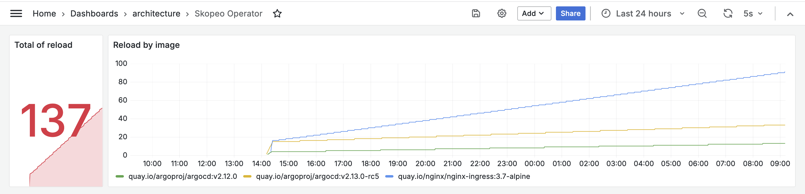

# skopeo-operator

## Install with Helm Chart

```bash
helm repo add skopeo-operator https://tchoupinax.github.io/skopeo-operator
helm repo update

helm upgrade --install skopeo-operator skopeo-operator/skopeo-operator
```

## Usage

According the use-case you have, select the good configuration for you:

### Copy raw images (`Image`)

Copying image is used to copy image from one registry to another. It works with every registries (public like private). Discovery features for versions is available for these public registries:

- `AWS public ECR`: https://gallery.ecr.aws
- `DockerHub`: https://hub.docker.com
- `Quay.io`: https://quay.io/search

#### I want to sync an image with a specific tag and I want to do only one

Use mode `OneShot` and fill version with you specific tag (e.g. `v1.2.3`).

#### I want to sync a version and I want all new version to be synced automatically

Use mode `OneShot` and fill version with a matching pattern (e.g. `v1.2.x`). It will sync current available version and watch for future version to sync them (`>v1.2.0 & <v1.3.0`)

#### I want to copy and refresh an image every day

Use mode `Recurrent` and provide the desired version (e.g. `node:22-alpine`)

#### Example of recurrent task

> I want to copy `quay.io/nginx/nginx-ingress:3.7-alpine` to `tchoupinax/nginx/nginx-ingress:3.7-alpine` every 15 minutes.

```yaml
apiVersion: skopeo.io/v1alpha1
kind: Image
metadata:
  name: nginx-alpine
spec:
  frequency: 15m
  mode: Recurrent
  source:
    name: quay.io/nginx/nginx-ingress
    version: 3.7-alpine
  destination:
    name: tchoupinax/nginx/nginx-ingress
    version: 3.7-alpine
```

### Example with tags matching pattern

You can order to copy every images matching a pattern. For exemple, if you want to copy every image like `2.13.1`, `2.13.2`, `2.13.3` etc... you can put version as `2.13.x`.
Moreover, if you want to include release candidate you can with the option `allowCandidateRelease: true`. It will create a Kubernetes job for each version detected.

> I want to copy every image `>=2.13` and `<2.14` and I accept release candidates (tag having `-rc{\d}{1,2}`)

```yaml
apiVersion: skopeo.io/v1alpha1
kind: Image
metadata:
  name: argocd-2-13-rc
spec:
  allowCandidateRelease: true
  mode: OneShot
  source:
    name: quay.io/argoproj/argocd
    version: v2.13.x
  destination:
    name: tchoupinax/argoproj/argocd
    version: v2.13.x
```

#### Example with full options explained

```yaml
apiVersion: skopeo.io/v1alpha1
kind: Image
metadata:
  name: name
spec:
  allowCandidateRelease: false # Activate if you want release which match *.*.*-rc[O-9]+
  mode: OneShot # Accepted: OneShot,OnceByTag,Recurrent
  frequency: "1m" #  Accepted: [O-9]+(s(second),m(minute),h(hour),d(day),(week)
  source:
    name: source/argoproj/argocd
    version: v2.13.x
  destination:
    name: destination/argoproj/argocd
    version: v2.13.x
```

### Build image (`ImageBuilder`)

#### Example with full options explained

```yaml
apiVersion: buildah.io/v1alpha1
kind: ImageBuilder
metadata:
  name: name
spec:
  architecture: "arm64" # Accepted: arm64;amd64;both
  image:
    name: destination/node
    version: 22-updated
    useAwsIRSA: false # Accepted: false,true
  source: | # This field is a Dockerfile
    FROM node:22
    RUN apt update -y && apt upgrade -y
  resources:
    limits:
      cpu: 1000m # Decouraged to setup a cpu limit
      memory: 2Gi
    requests:
      cpu: 500m
      memory: 1Gi
```

## Motivation

We aim to use container images exclusively from our internal registry for various reasons. Among these images, a significant portion consists of "base" images that we did not build ourselves. However, the process of copying these base images presents several challenges:

- It may require authentication, adding complexity to the process.
- Copying images for multiple architectures simultaneously can be cumbersome.
- Not everyone in the organization may have the necessary permissions to perform this operation.
- The stability of the process can vary depending on the method used (e.g., CI/CD pipelines).

Among the various open-source projects known for their ability to build and copy images, one stands out for its efficiency in copying images across registries: [Skopeo](https://github.com/containers/skopeo).

How can we industrialize this process? While it’s possible to use CI for this purpose, incorporating a one-off task into the CI pipeline doesn’t seem advantageous. For example, if we only need to copy the nginx:1.1.1-alpine image once, embedding this operation into the CI process isn't relevant or efficient. We need a more suitable approach for handling such single-use cases. The same limitations apply to recurring tasks. While CI systems can be configured to handle such tasks with scheduled jobs or cron-like setups, they are quite limited.

The idea of building an operator around Skopeo originates from the desire to leverage the right tool in conjunction with the operator pattern, to benefit from Kubernetes's simplicity and scalability.

## Description


## Configuration

## Helm chart

You can find an exemple of values [here](charts/skopeo-operator/values.yaml).

### Environment variables list

- `BUILDAH_IMAGE`: "quay.io/containers/buildah"
- `BUILDAH_PRIVILEGED_CONTAINER`: false
- `BUILDAH_VERSION`: "v1.37.3"
- `BUILDAH_JOB_NAMESPACE`: "skopeo-operator"
- `CREDS_DESTINATION_PASSWORD`: ""
- `CREDS_DESTINATION_USERNAME`: ""
- `CREDS_SOURCE_PASSWORD`: ""
- `CREDS_SOURCE_USERNAME`: ""
- `DISABLE_DEST_TLS_VERIFICATION`: "false"
- `DISABLE_SRC_TLS_VERIFICATION`: "false"
- `PULL_JOB_NAMESPACE`: "skopeo-operator"
- `SKOPEO_IMAGE`: "quay.io/containers/skopeo"
- `SKOPEO_VERSION`: "v1.16.1"

## Features

- [x] Copy images accross registries
- [x] Copy images recurrently, frequency is configurable
- [x] Authentication on Password and Username
- [x] Basic monitoring and metrics
- [x] Allow to copy release candidates
- [x] Allow to target version following a pattern
  - [x] Quay.io
  - [x] Dockerhub
  - [x] AWS public ECR
- [x] Build cross architectures images

## Monitoring

Operator exposes a Prometheus route to show basic metrics about operator and how many reload it has been done.



## Development

### Tests

Command to launch a specific test

```bash
go run github.com/onsi/ginkgo/v2/ginkgo -r --randomize-all --randomize-suites --race --trace -cover internal/helpers/
```

Focus a test

```
go run github.com/onsi/ginkgo/v2/ginkgo run --focus "Node.js" internal/helpers/
```

## Rate limiting

### Dockerhub

[source](https://www.docker.com/blog/checking-your-current-docker-pull-rate-limits-and-status)
